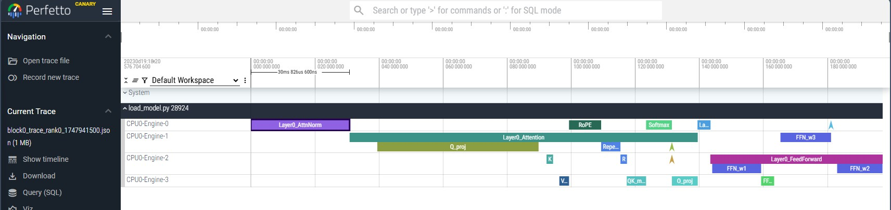

# LLaMA-3.2 × Perfetto Tracing & Profiling  
*Progress snapshot – 21 May 2025*

---

## 🎯 Project Goal  
Visualise **one transformer block** of any LLaMA-3.2 checkpoint with **Perfetto**, capturing every key compute & memory step (dot-product, multi-pass soft-max, RoPE, layer norms, residual adds, KV-cache I/O, MLP, …) and embedding rich tensor-metadata in the trace.


---

## 📸 Example Visualization




---

## 🔧 Quick Start

```bash
# 1 · Create / activate a Python env
bash setup.sh

# 2 · Download weights into the models/ directory
#    (example for 1-B checkpoints)
huggingface-cli download meta-llama/Llama-3.2-1B \
    --local-dir ./models/Llama-3.2-1B

# 3 · Generate Perfetto JSON trace on a HF checkpoint (layer 0)
python load_model.py
